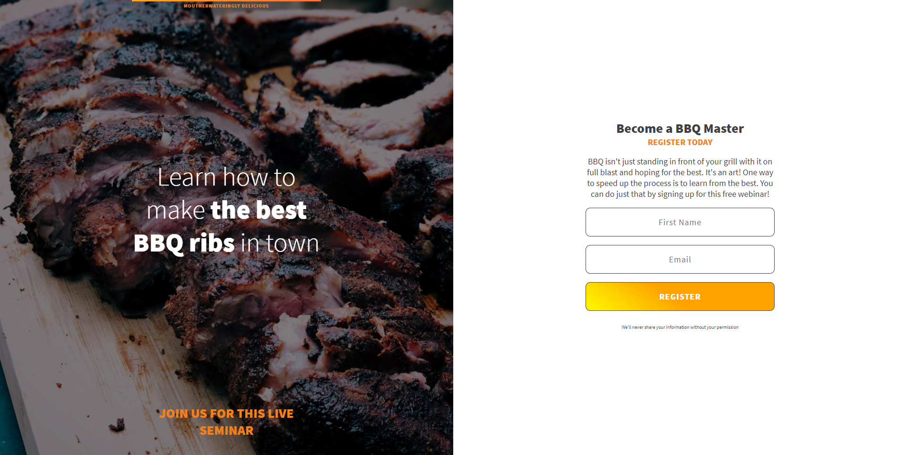
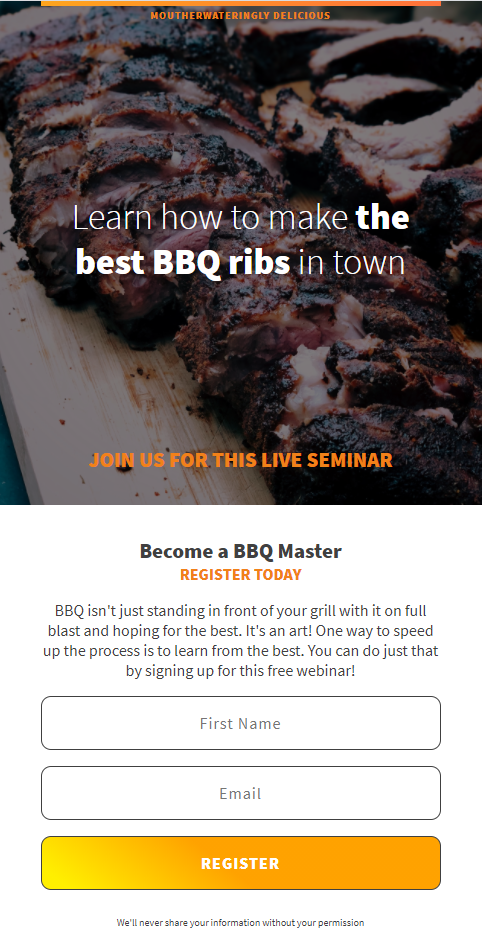

# Summary

This is a layout of a mock BBQ party registration page. It was made using the mobile-first layout. The most interesting property used for the layout was the usage of background-blend, which added a nice dark contrast to the image of the ribs.

## Screenshot of Layout

This can also be viewed on <a src="https://renko7.github.io/bbq_splash_page/">GitHub Pages</a>

